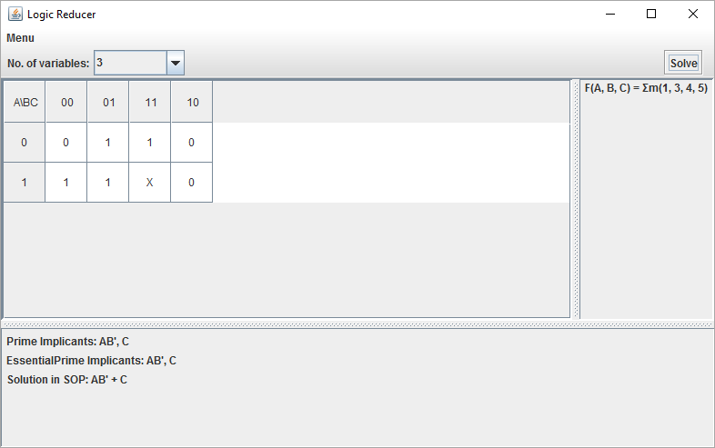

# Logic-Reducer
Logic Reducer is an intuitive, versatile GUI application for simplifying Karnaugh maps and boolean functions. 

## Features

* Minimize Boolean formulae up to 26 variables
* Displays Prime Implicants and Essential Prime Implicants
* Convert Boolean formulae into SOP, POS and decimal notation
* Step by step simplification of Boolean and propositional expressions
* Uses QuineMcCluskey Algorithm

# License
All the code files are licensed under the [MIT](LICENSE) License.